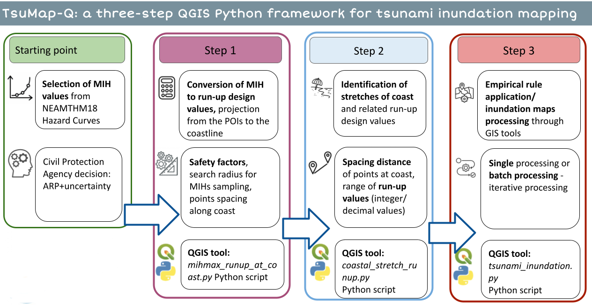
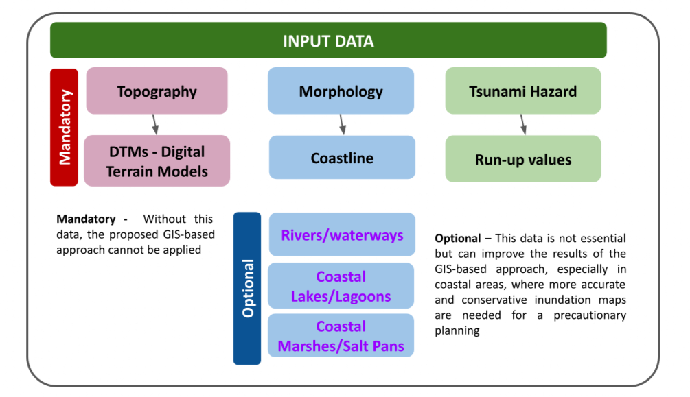
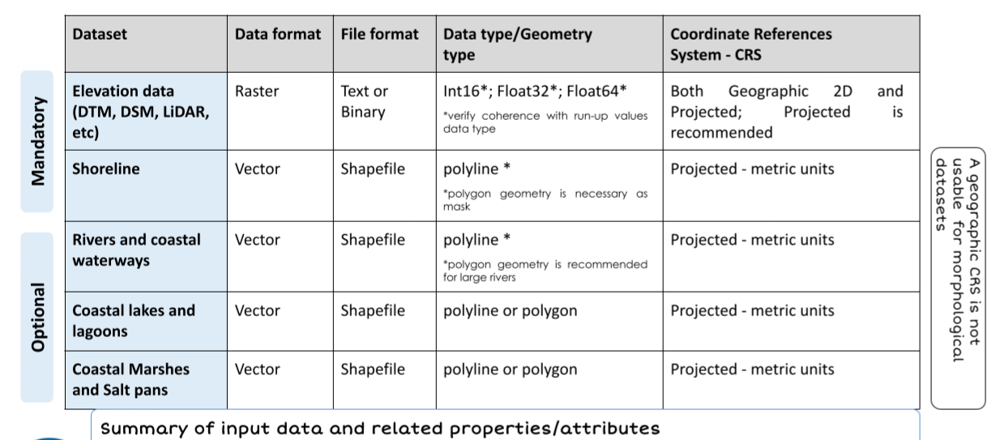
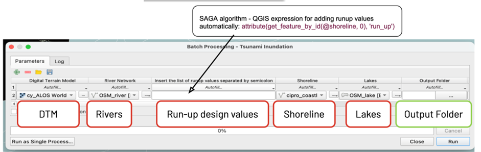
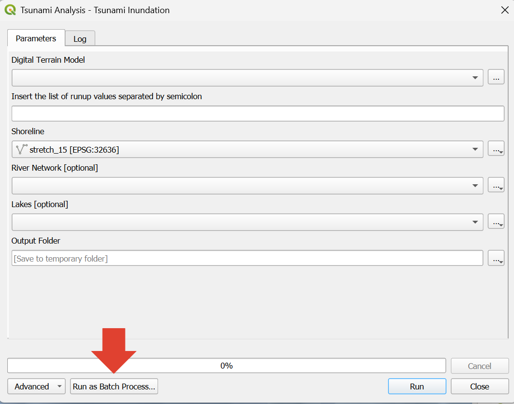
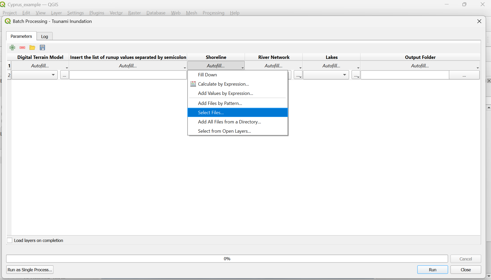
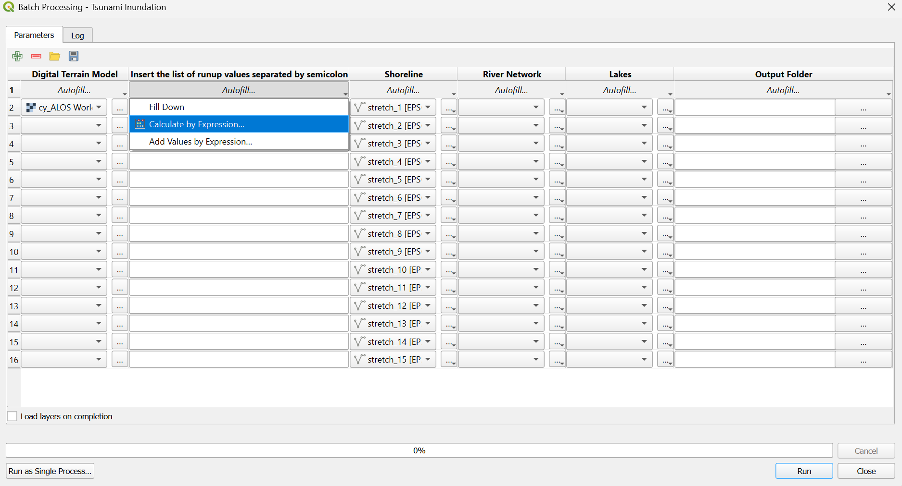
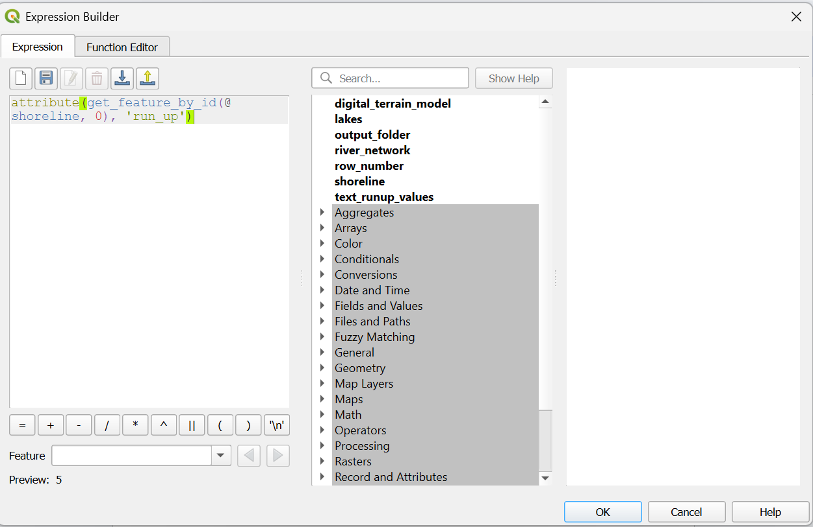
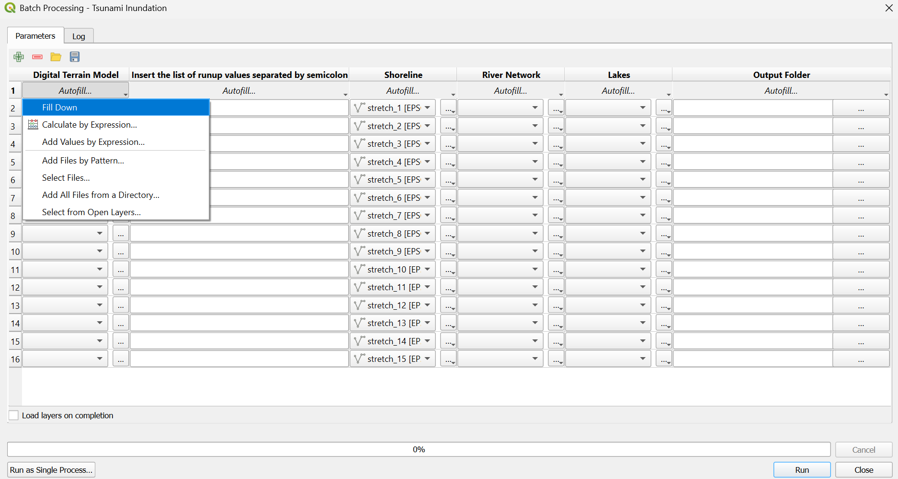

# TsuMap-Q

TsuMap-Q is a three-step QGIS python framework to rapidly calculate tsunami inundation maps. The method was developed and adopted in the frame of the Italian Tsunami Warning System (SiAM, Sistema di Allertamento da Maremoto).

Tsunami inundation maps are foundational tools in the field of coastal risk assessment, management, and planning. They represent a cornerstone for the quantitative and spatial assessment of tsunami hazard, supporting the adoption of risk mitigation strategies. In particular, inundation maps contribute to the design and operation of tsunami early warning systems — especially with regard to evacuation maps and evacuation planning — and ultimately enhance coastal development planning and regulation.
Inundation maps are typically the output of probabilistic modeling approaches that delineate areas exposed to varying levels of hazard under different tsunami scenarios, each associated with specific probabilities of occurrence and uncertainty distributions. 
Based on the availability of input data and calculation resources and time, different models and approaches may be applied for inundation maps processing. On this basis, can distinguish among two main categories: hydrodynamic and hydrostatic approaches. Hydrodynamic models rely on numerical modelling requiring high-resolution data (which is usually not available for large areas), and high storage capacity and computational power, which make it  unsuitable for our purposes. Among the hydrostatic models, we exclude the direct utilization of the bathtub approach due to its limitations for relatively flat coastal areas (e.g., a coastal plain, river mouth, etc.). The bathtub model may result in a large overestimation of inundation, as it does not account for the dissipative characteristics of inland water propagation. The methodology we are proposing is based on an empirical model of propagation and inundation with the introduction of an empirical dissipation factor, based on observations, to limit maximum inundation in flat, dissipative coastal areas and to better approximate the actual propagation process. Specifically, we refer to an empirical linear rule between the run-up values at coast and the maximum expected inland inundation distance proposed by Fraser and Power (2013; https://mro.massey.ac.nz/server/api/core/bitstreams/f18334d4-883b-4de1-a775-f4b15d5ed80c/content). Detailed description of the methodology is available in Tonini et al, 2021](https://doi.org/10.3389/feart.2021.628061,where its application through dedicated GIS tools is emphasised. 
This set of tools allows to build inundation maps supporting the application of the methodology in 3 steps (Fig 1): the first step consists of converting MIH values into design run-up and  transferring  these values from the POIs to the coastline; the second one assigns run-up values to coastal stretches and finally step 3 allows to build inundation maps for coastal stretches. A short video tutorial has been prepared for each step.

Fig.1 - Comprehensive GIS-based workflow. The starting point is the availability of a regional PTHA hazard model and a decision-making process by the Civil Protection Agency, focusing on threshold values and acceptable risk levels. Subsequently, three steps are used to process the inundation maps.
## Input Data

The application of this GIS-based methodology for inundation map processing relies on the availability of topographic and morphological data, along with a defined Tsunami Hazard Model. The model provides hazard curves that express hazard levels as MIH values at each POI (Point of Interest) along the coast, for different Average Return Periods (ARP) and different percentiles of the uncertainty distribution.  A key advantage of this approach is that it does not require bathymetric data. 
The process is based on GIS tools and functionalities; therefore, all input data must be organized and available as geographic datasets.The set of data can be distinguished in mandatory and optional (Fig. 2). Mandatory -  Without this data, the proposed GIS-based approach cannot be applied; Optional – This data is not essential but can improve the results of the GIS-based approach, especially in coastal areas, where more accurate and conservative inundation maps are needed for a precautionary planning.

Fig. 2 - Input data for the application of the proposed GIS -based approach

The main mandatory input data:

    * MIH values at POI's, a point geometry shapefile with a field containing MIH values, derived from a Probabilistic Tsunami Hazard Assessment. 
    * Digital Terrain Model, **DTM** with a metric coordinate system
    * Vectorial shoreline shapefile with polyline geometry
    * Output folder the path, where the results will be saved

Optional input data:

    * River network and coastal waterways shapefile with polyline geometry (polygon geometry is recommended only for large rivers)
    * Lakes shapefile with polyline or polygon geometry
* Coastal marshes and salt pans with polyline or polygon geometry; Projected CRS and metric units.

Fig. 3 - Schematic summary of input data and related properties and attributes

## STEP 1: MIH to Runup Values
Input data:
* Tsunami Hazard Model as a point geometry shapefile of POIs (Point of Interest). Specifically, the tool refers to the NEAMTHM18 but any other model can be used. CRS projected  with metric coordinate units. Make sure this file has a field containing MIH values.
* Shoreline: a polyline geometry shapefile, with a metric coordinate system. Make sure the file has ONLY one feature.
* Amplification Factor: The safety factor to consider in the conversion of MIH values in run-up values to take into account for lateral dispersion;  , the higher the safety factor, the more conservative results.
* Points distance:the distance in METERS between points along the coastline on which the run-up values will be calculated.
* Search Radius: the radius of the circular neighborhood used for sampling points of interest (POIs) and associated MIH values. The procedure is based on a spatial analysis algorithm that performs MIH sampling within this radius, centered at each point along the coastline. The run-up value at each coastal point is computed as a function of the maximum MIH value identified within the corresponding search domain.

* Output folder path: the directory where the results will be saved.
To ensure consistency, all files MUST use the same metric coordinate system.
The expected result is a shapefile with a point geometry, with the calculated runup to the coastline shown in the field “runup_mih_value”

## STEP 2: Assign Runup Values to coastal stretches
Input data:
* Point Distance: the distance in METERS between points along the coastline, used/defined in STEP 1.
* Point runup: a shapefile with a point geometry, with the calculated runup to the coastline shown in the field “runup_mih_value” (The Output file from STEP 1)
* Run-up field: the field of the input shapefile “Point runup” containing the calculated run up value, preferably an integer type.
* Shoreline: a polyline geometry shapefile, with a metric coordinate system. Make sure the file has ONLY one feature.
* Output file: the shapefile where the results will be saved.
* All files MUST have the same metric coordinate system.
The expected result is a shapefile with a polyline geometry, with the coastline divided into segments with a runup value associated and a field with an ID for each coastal stretch.

## STEP 3: Inundation Maps
This tool will generate the inundation map for the run up value assigned to each coastal stretch.
Input data:
* Digital Terrain Model (DEM): the digital terrain model covering the study area in a metric coordinate system consistent with the vectorial data.
* Shoreline: a shapefile with polyline geometry. In case of iterative mode application (batch processing), the input must be the shapefile generated as the output of step 2, in which the coastline is segmented and each segment has an associated run-up value. 
* River Network (Optional): a polyline geometry shapefile, with a metric coordinate system describing the rivers near the coast. For large Rivers, the use of a polygon geometry shapefile is recommended.
* Lakes (Optional): a polygon geometry shapefile, with a metric coordinate system describing the lakes and marine lagoons near the coast.
* Output folder path: the directory where the results will be saved.
* All files MUST have the same metric coordinate system.
The Step 3 application can be executed as a single processing mode, using either a single design run-up value or multiple values (comma-separated), for inundation mapping of one or more coastal sectors. Alternatively, an iterative processing mode can be used (batch processing), enabling the execution of the procedure across multiple coastal stretches with their corresponding design run-up values. In this mode, different input datasets may also be specified for each coastal stretch under analysis.

Some tips to add the input data to the batch processing tool

a)Enabling the batch processing, you will find the enabling button at the bottom of the dialog box.

b)Start with the shoreline input, using the “auto

attribute(get_feature_by_id(@shoreline, 0), 'run_up')

## Authors and acknowledgment
These tools have been developed by ISPRA, The Italian Institute for Environmental Protection and Research, ISPRA (Istituto Superiore per la Protezione e la Ricerca Ambientale) and INGV The National Institute of Geophysics and Volcanology (Istituto Nazionale di Geofisica e Vulcanologia), and have been partially funded by the EU-DG ECHO - NEAM-COMMITMENT project.

## License
CC by 4.0.

## Citation
Di Manna, P. Brizuela, B., Tonini, R., TsuMaps - Tools. Tsunami Inundation Mapping Tools for QGIS, XXX.V1

